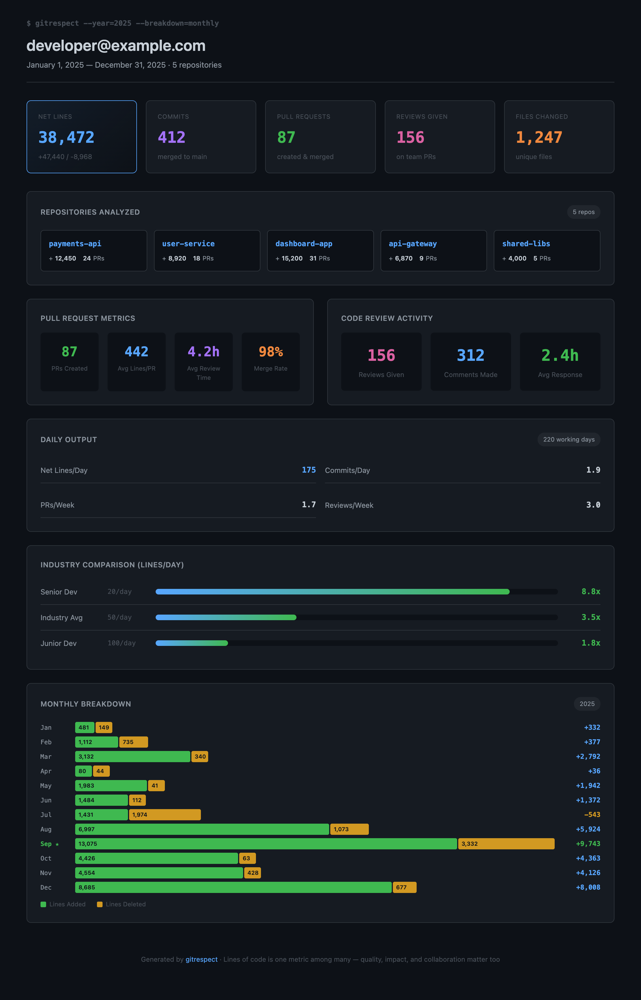
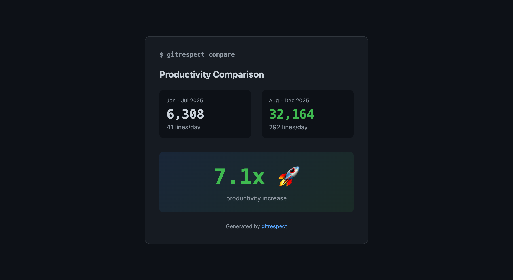
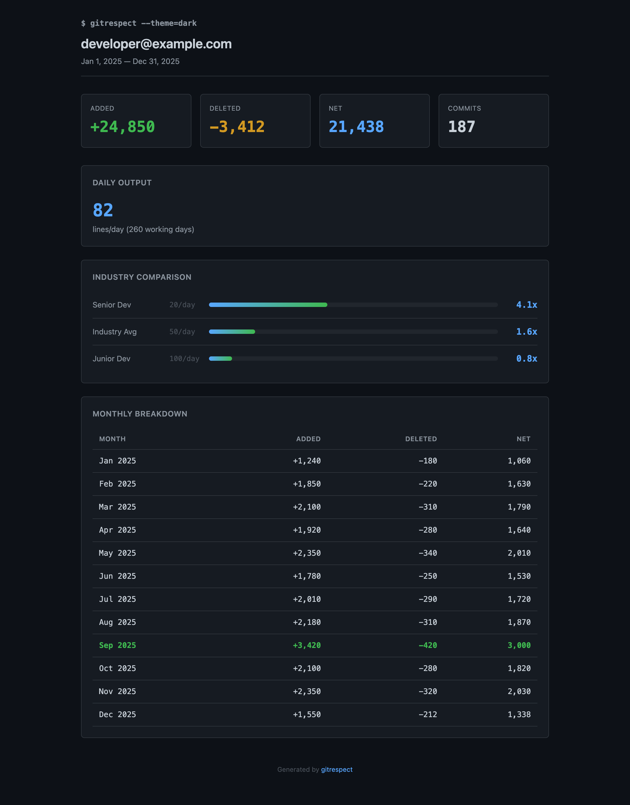
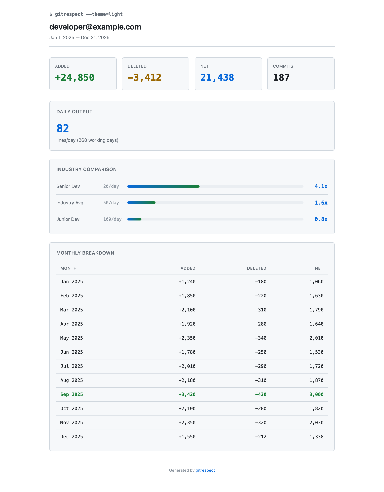

# gitrespect

> Respect your git work with real metrics

A fast CLI tool that analyzes git repositories and provides comprehensive developer productivity metrics. **Measure the real impact of AI tools on your productivity**, track team contributions, and compare against industry benchmarks.



## Why gitrespect?

**Measure AI Impact on Productivity**

The rise of AI coding assistants (Copilot, Claude, Cursor) is changing how we write code. But how do you know if it's actually making you more productive? gitrespect lets you:

- Compare your output before vs after adopting AI tools
- Quantify the productivity multiplier with real data
- Track team-wide AI adoption impact
- Generate shareable reports for stakeholders

## Features

- **AI Productivity Comparison** - Measure before/after impact of AI tools on your workflow
- **Team Analysis** - Analyze multiple contributors as a team or organization
- **Lines of Code** - Track added, deleted, and net lines across repositories
- **Multi-repo Support** - Analyze multiple repositories at once
- **Industry Comparison** - Compare against senior dev, industry avg, and junior dev benchmarks
- **Multiple Output Formats** - Terminal, HTML reports (dark mode), JSON export

## Installation

### Homebrew (macOS/Linux)

```bash
brew install juangracia/gitrespect/gitrespect
```

### Using Go

```bash
go install github.com/juangracia/gitrespect@latest
```

### Download Binary

Download the latest release from [GitHub Releases](https://github.com/juangracia/gitrespect/releases).

#### macOS

```bash
# Apple Silicon (M1/M2/M3)
curl -L https://github.com/juangracia/gitrespect/releases/latest/download/gitrespect-darwin-arm64.tar.gz | tar xz
sudo mv gitrespect /usr/local/bin/

# Intel Mac
curl -L https://github.com/juangracia/gitrespect/releases/latest/download/gitrespect-darwin-amd64.tar.gz | tar xz
sudo mv gitrespect /usr/local/bin/
```

#### Linux

```bash
# x86_64
curl -L https://github.com/juangracia/gitrespect/releases/latest/download/gitrespect-linux-amd64.tar.gz | tar xz
sudo mv gitrespect /usr/local/bin/

# ARM64
curl -L https://github.com/juangracia/gitrespect/releases/latest/download/gitrespect-linux-arm64.tar.gz | tar xz
sudo mv gitrespect /usr/local/bin/
```

#### Windows

```powershell
# Download from GitHub Releases
# Extract gitrespect-windows-amd64.zip
# Add to PATH or move to a directory in your PATH
```

### Build from Source

```bash
git clone https://github.com/juangracia/gitrespect.git
cd gitrespect
go build -o gitrespect ./cmd/gitrespect
```

## Usage

### Basic Analysis

Run in any git repository to see your contribution stats for the last 30 days:

```bash
gitrespect
```

Output:
```
 gitrespect - developer@example.com
my-project (Dec 4 2025 to Jan 3 2026)
──────────────────────────────────────────────────

  Added       Deleted     Net         Commits
  ────────────────────────────────────────────
  2,847       312         2,535       47

  Daily avg: 127 lines/day (22 working days)

  vs Industry:
  ├── Senior Dev (20/day):     6.4x ████████████████████░░░░
  ├── Industry Avg (50/day):   2.5x ████████░░░░░░░░░░░░░░░░
  └── Junior Dev (100/day):    1.3x ████░░░░░░░░░░░░░░░░░░░░
```

### Measure AI Impact (Before/After Comparison)

The killer feature: measure how AI tools have changed your productivity.

```bash
gitrespect compare --before=2025-01:2025-07 --after=2025-08:2025-12
```



Output:
```
 gitrespect - Period Comparison
──────────────────────────────────────────────────

  Period           Net Lines   Days    Per Day
  ─────────────    ──────────  ──────  ────────
  2025-01:2025-07  6,308       154     41
  2025-08:2025-12  32,164      110     292

  Change: +7.1x productivity increase 🚀
```

**Use cases:**
- Before/after adopting GitHub Copilot
- Before/after switching to Claude or Cursor
- Comparing productivity across different project phases
- Quantifying the ROI of AI tools for your team

### Team Analysis

Analyze contributions across your entire team:

```bash
gitrespect --team=dev1@company.com,dev2@company.com,dev3@company.com --year=2025
```

Output:
```
 gitrespect - Team Report
Jan 1 2025 to Dec 31 2025
────────────────────────────────────────────────────────────

  Team Totals
  Added       Deleted     Net         Commits
  ────────────────────────────────────────────
  45,230      3,127       42,103      312

  Team daily avg: 162 lines/day (260 working days)

  Team Members
  Contributor                         Net       Commits  /day
  ────────────────────────────────────────────────────────
  dev1@company.com                    18,450    128      71
  dev2@company.com                    15,230    98       59
  dev3@company.com                    8,423     86       32
```

### Analyze Specific Path

```bash
gitrespect /path/to/repo
```

### Multiple Repositories

```bash
gitrespect ./api ./frontend ./gateway
```

### Scan Directory for Repos

Analyze all git repositories in a folder:

```bash
gitrespect -r ~/projects
```

### Filter by Year

```bash
gitrespect --year=2025
```

### Monthly Breakdown

```bash
gitrespect --year=2025 --breakdown=monthly
```

### Custom Date Range

```bash
gitrespect --since=2025-01-01 --until=2025-06-30
```

### Filter by Author

```bash
gitrespect --author="developer@example.com"
```

### Export to HTML

```bash
gitrespect --year=2025 --breakdown=monthly --output=html --file=report.html
```

### HTML Theme Options

Choose between dark (default) and light themes:

**Dark theme (default):**
```bash
gitrespect --output=html --theme=dark --file=report.html
```



**Light theme:**
```bash
gitrespect --output=html --theme=light --file=report.html
```



### Export to JSON

```bash
gitrespect --output=json --file=stats.json
```

### Team HTML Report

```bash
gitrespect --team=dev1@example.com,dev2@example.com --output=html --file=team-report.html
```

## All Options

```
gitrespect [paths...] [flags]

Flags:
  -a, --author string      Filter by author email (default: git config user.email)
  -t, --team strings       Team mode: analyze multiple authors (comma-separated emails)
  -r, --recursive          Scan subdirectories for git repositories
  -s, --since string       Start date (YYYY-MM-DD or "30 days ago") (default: "30 days ago")
  -u, --until string       End date (default: now)
      --year int           Filter by year (e.g., --year=2025)
  -b, --breakdown string   Show breakdown: monthly, weekly, or daily
  -o, --output string      Output format: terminal, json, or html (default: terminal)
  -f, --file string        Output file path (for html/json)
      --theme string       HTML theme: dark or light (default: dark)
  -h, --help               Show help

Commands:
  gitrespect compare       Compare two time periods
  gitrespect version       Show version info
```

## Industry Benchmarks

gitrespect compares your output against commonly cited industry benchmarks:

| Level | LOC/Day | Source |
|-------|---------|--------|
| Senior Dev | 20 | Fred Brooks, "The Mythical Man-Month" |
| Industry Avg | 50 | Various industry surveys |
| Junior Dev | 100 | New developers often have higher raw output |

**Note:** Lines of code is just one metric. Quality, architecture decisions, code reviews, and mentoring are equally important contributions that aren't captured here.

## How It Works

gitrespect uses `git log --numstat` to count lines added and deleted per commit, filtered by author and date range. It calculates working days (approximately 5/7 of calendar days) for daily averages.

## Use Cases

### For Individual Developers
- Track your personal productivity trends
- Measure impact of new tools or workflows
- Generate reports for performance reviews
- Compare productivity across different projects

### For Engineering Managers
- Understand team contribution patterns
- Measure team-wide AI tool adoption impact
- Identify productivity trends
- Generate reports for stakeholders

### For Organizations
- Quantify ROI of AI coding tools
- Compare team productivity metrics
- Track productivity before/after process changes

## Contributing

Contributions welcome! Please open an issue or submit a PR.

See [CONTRIBUTING.md](CONTRIBUTING.md) for guidelines.

## Author

Created by [Juan Gracia](https://github.com/juangracia)

## License

MIT License - see [LICENSE](LICENSE) file.

Use it freely, modify it, share it. No attribution required, but a star is always appreciated!
