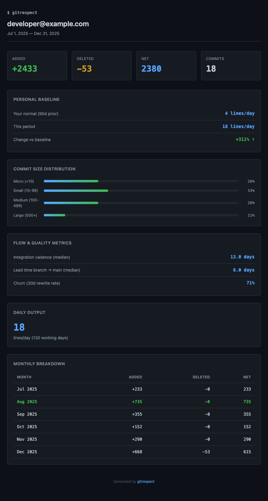
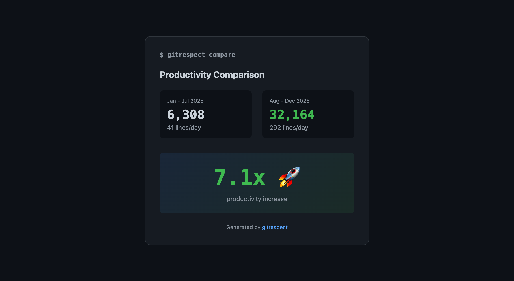
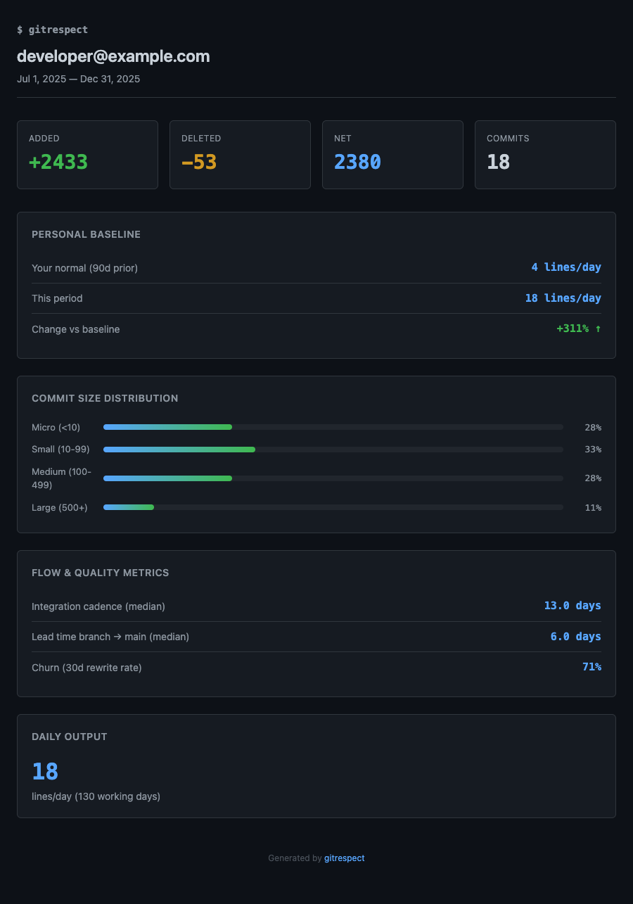
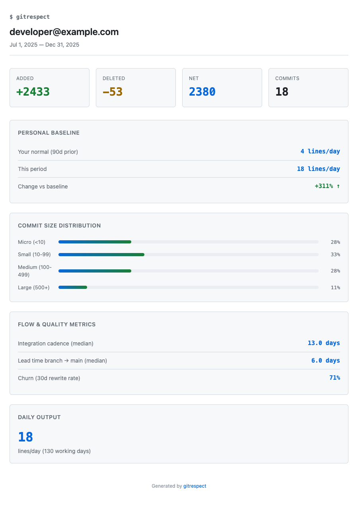

# gitrespect

> Respect your git work with real metrics

A fast CLI tool that analyzes git repositories and provides comprehensive developer productivity metrics. **Measure the real impact of AI tools on your productivity**, track team contributions, and benchmark against your own personal baseline.



## Why gitrespect?

**Measure AI Impact on Productivity**

The rise of AI coding assistants (Copilot, Claude, Cursor) is changing how we write code. But how do you know if it's actually making you more productive? gitrespect lets you:

- Compare your output before vs after adopting AI tools
- Quantify the productivity multiplier with real data
- Track team-wide AI adoption impact
- Generate shareable reports for stakeholders

## Features

- **AI Productivity Comparison** - Measure before/after impact of AI tools on your workflow
- **Personal Baseline** - Compare this period against your own normal output (no arbitrary industry numbers)
- **Flow & Quality Metrics** (opt-in) - Commit size distribution, integration cadence, lead time (branch → main), and churn
- **Team Analysis** - Analyze multiple contributors as a team or organization
- **Lines of Code** - Track added, deleted, and net lines across repositories
- **Multi-repo Support** - Analyze multiple repositories at once
- **Multiple Output Formats** - Terminal, HTML reports (dark/light themes), JSON export
- **AI Agent Skill** - Bundled [skill](.claude/skills/gitrespect/SKILL.md) so Claude Code / Codex can run gitrespect for you

## Installation

### Homebrew (macOS/Linux)

```bash
brew install juangracia/gitrespect/gitrespect
```

### Using Go

```bash
go install github.com/juangracia/gitrespect@latest
```

### Download Binary

Download the latest release from [GitHub Releases](https://github.com/juangracia/gitrespect/releases).

#### macOS

```bash
# Apple Silicon (M1/M2/M3)
curl -L https://github.com/juangracia/gitrespect/releases/latest/download/gitrespect-darwin-arm64.tar.gz | tar xz
sudo mv gitrespect /usr/local/bin/

# Intel Mac
curl -L https://github.com/juangracia/gitrespect/releases/latest/download/gitrespect-darwin-amd64.tar.gz | tar xz
sudo mv gitrespect /usr/local/bin/
```

#### Linux

```bash
# x86_64
curl -L https://github.com/juangracia/gitrespect/releases/latest/download/gitrespect-linux-amd64.tar.gz | tar xz
sudo mv gitrespect /usr/local/bin/

# ARM64
curl -L https://github.com/juangracia/gitrespect/releases/latest/download/gitrespect-linux-arm64.tar.gz | tar xz
sudo mv gitrespect /usr/local/bin/
```

#### Windows

```powershell
# Download from GitHub Releases
# Extract gitrespect-windows-amd64.zip
# Add to PATH or move to a directory in your PATH
```

### Build from Source

```bash
git clone https://github.com/juangracia/gitrespect.git
cd gitrespect
go build -o gitrespect ./cmd/gitrespect
```

## Usage

### Basic Analysis

Run in any git repository to see your contribution stats for the last 30 days:

```bash
gitrespect
```

Output:
```
 gitrespect - developer@example.com
my-project (Dec 4 2025 to Jan 3 2026)
──────────────────────────────────────────────────

  Added       Deleted     Net         Commits
  ────────────────────────────────────────────
  2,847       312         2,535       47

  Daily avg: 127 lines/day (22 working days)

  Baseline (90d prior):
  └── Your normal: 84 lines/day → this period: 127 (+51% ↑)
```

By default gitrespect compares this period against **your own baseline** computed
from the prior 90 days of history (configurable via `--baseline-window`). Add
`--metrics` to opt into deeper flow and quality metrics (see [Opt-in Metrics](#opt-in-metrics)).

### Measure AI Impact (Before/After Comparison)

The killer feature: measure how AI tools have changed your productivity.

```bash
gitrespect compare --before=2025-01:2025-07 --after=2025-08:2025-12
```



Output:
```
 gitrespect - Period Comparison
──────────────────────────────────────────────────

  Period           Net Lines   Days    Per Day
  ─────────────    ──────────  ──────  ────────
  2025-01:2025-07  6,308       154     41
  2025-08:2025-12  32,164      110     292

  Change: +7.1x productivity increase 🚀
```

**Use cases:**
- Before/after adopting GitHub Copilot
- Before/after switching to Claude or Cursor
- Comparing productivity across different project phases
- Quantifying the ROI of AI tools for your team

### Team Analysis

Analyze contributions across your entire team:

```bash
gitrespect --team=dev1@company.com,dev2@company.com,dev3@company.com --year=2025
```

Output:
```
 gitrespect - Team Report
Jan 1 2025 to Dec 31 2025
────────────────────────────────────────────────────────────

  Team Totals
  Added       Deleted     Net         Commits
  ────────────────────────────────────────────
  45,230      3,127       42,103      312

  Team daily avg: 162 lines/day (260 working days)

  Team Members
  Contributor                         Net       Commits  /day
  ────────────────────────────────────────────────────────
  dev1@company.com                    18,450    128      71
  dev2@company.com                    15,230    98       59
  dev3@company.com                    8,423     86       32
```

### Analyze Specific Path

```bash
gitrespect /path/to/repo
```

### Multiple Repositories

```bash
gitrespect ./api ./frontend ./gateway
```

### Scan Directory for Repos

Analyze all git repositories in a folder:

```bash
gitrespect -r ~/projects
```

### Filter by Year

```bash
gitrespect --year=2025
```

### Monthly Breakdown

```bash
gitrespect --year=2025 --breakdown=monthly
```

### Custom Date Range

```bash
gitrespect --since=2025-01-01 --until=2025-06-30
```

### Filter by Author

```bash
gitrespect --author="developer@example.com"
```

### Export to HTML

```bash
gitrespect --year=2025 --breakdown=monthly --output=html --file=report.html
```

### HTML Theme Options

Choose between dark (default) and light themes:

**Dark theme (default):**
```bash
gitrespect --output=html --theme=dark --file=report.html
```



**Light theme:**
```bash
gitrespect --output=html --theme=light --file=report.html
```



### Opt-in Metrics

Beyond lines of code and the personal baseline, gitrespect can compute deeper
flow and quality metrics. These are **opt-in** (they run extra git queries) via
the `--metrics` flag, which takes a comma-separated list or `all`:

```bash
# Everything
gitrespect --metrics=all

# Just the ones you want
gitrespect --metrics=commit-size,churn

# Full HTML report with every section
gitrespect --year=2025 --breakdown=monthly --metrics=all --output=html --file=report.html
```

| Metric | Flag value | What it shows |
|--------|-----------|---------------|
| Commit size distribution | `commit-size` | % of commits that are micro (<10), small (10-99), medium (100-499), large (500+) |
| Integration cadence | `cadence` | Median days between commits on the main branch |
| Lead time | `lead-time` | Median days from a feature branch's first commit to its merge into main |
| Churn | `churn` | % of recently added lines rewritten within the churn window (`--churn-window`, default 30d) |

The personal baseline window is controlled with `--baseline-window` (e.g. `30d`,
`90d`, `6m`, `1y`). To bring back the deprecated Senior/Avg/Junior comparison,
pass `--legacy-benchmark`.

### Export to JSON

```bash
gitrespect --output=json --file=stats.json
```

### Team HTML Report

```bash
gitrespect --team=dev1@example.com,dev2@example.com --output=html --file=team-report.html
```

## All Options

```
gitrespect [paths...] [flags]

Flags:
  -a, --author string        Filter by author email (default: git config user.email)
  -t, --team strings         Team mode: analyze multiple authors (comma-separated emails)
  -r, --recursive            Scan subdirectories for git repositories
      --per-repo             Show breakdown by repository when analyzing multiple repos
  -s, --since string         Start date (YYYY-MM-DD or "30 days ago") (default: "30 days ago")
  -u, --until string         End date (default: now)
      --year int             Filter by year (e.g., --year=2025)
  -b, --breakdown string     Show breakdown: monthly, weekly, or daily
  -e, --exclude strings      Exclude files matching glob patterns (e.g. -e 'vendor/*')
      --metrics string       Opt-in metrics: comma list of churn,lead-time,commit-size,cadence, or 'all'
      --baseline-window str  Personal baseline window (e.g. 30d, 90d, 6m, 1y) (default: "90d")
      --churn-window string  Churn detection window (default: "30d")
      --legacy-benchmark     Show deprecated Senior/Avg/Junior comparison instead of personal baseline
  -o, --output string        Output format: terminal, json, or html (default: terminal)
  -f, --file string          Output file path (for html/json)
      --theme string         HTML theme: dark or light (default: dark)
  -h, --help                 Show help

Commands:
  gitrespect compare       Compare two time periods
  gitrespect version       Show version info
```

## Personal Baseline

Instead of comparing you against arbitrary industry numbers, gitrespect compares
this period against **your own normal output**. It computes a baseline from the
prior `--baseline-window` (default 90 days) of your commit history and reports how
this period stacks up:

```
Baseline (90d prior):
└── Your normal: 84 lines/day → this period: 127 (+51% ↑)
```

If there isn't enough prior history (under ~30 days of activity in the window),
gitrespect says so rather than inventing a comparison.

> The old Senior/Avg/Junior industry benchmark is deprecated but still available
> via `--legacy-benchmark` for anyone who relied on it.

**Note:** Lines of code is just one metric. Quality, architecture decisions, code reviews, and mentoring are equally important contributions that aren't captured here. The opt-in flow metrics (cadence, lead time, churn) give a fuller picture.

## For AI Agents

gitrespect ships with a [skill](.claude/skills/gitrespect/SKILL.md) that teaches AI
coding agents (Claude Code, Codex, and compatible tools) how to run it: which
flags to use, how to opt into metrics, and how to read the output. Clone the repo
and the skill is picked up automatically, or point your agent at
`.claude/skills/gitrespect/SKILL.md`.

## How It Works

gitrespect uses `git log --numstat` to count lines added and deleted per commit, filtered by author and date range. It calculates working days (approximately 5/7 of calendar days) for daily averages.

## Use Cases

### For Individual Developers
- Track your personal productivity trends
- Measure impact of new tools or workflows
- Generate reports for performance reviews
- Compare productivity across different projects

### For Engineering Managers
- Understand team contribution patterns
- Measure team-wide AI tool adoption impact
- Identify productivity trends
- Generate reports for stakeholders

### For Organizations
- Quantify ROI of AI coding tools
- Compare team productivity metrics
- Track productivity before/after process changes

## Contributing

Contributions welcome! Please open an issue or submit a PR.

See [CONTRIBUTING.md](CONTRIBUTING.md) for guidelines.

## Author

Created by [Juan Gracia](https://github.com/juangracia)

## License

MIT License - see [LICENSE](LICENSE) file.

Use it freely, modify it, share it. No attribution required, but a star is always appreciated!
